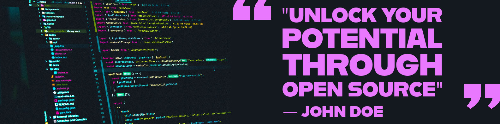

# Web Development BootCamp Repository

Welcome to the Web Development Resource Repository! This project aims to provide a curated collection of high-quality web development resources, including online courses, tutorials, articles, books, videos, and tools. Whether you're a beginner or an experienced developer, you'll find valuable materials here to enhance your web development skills and knowledge.

## How to Contribute

We welcome contributions from the web development community to help make this repository even more valuable. Here's how you can get involved:

1. **Fork this repository**: Click the "Fork" button to create your copy of the repository.

2. **Add or Update Resources**:
   - Navigate to the relevant category or create a new one if needed.
   - Edit the `README.md` file within the category to add or update resources.
   - Follow the contribution guidelines outlined in the [CONTRIBUTE.md](CONTRIBUTE.md) file.

3. **Create a Pull Request**:
   - Submit a pull request to the main repository, explaining the changes you've made.
   - Your contribution will be reviewed, and feedback may be provided.

4. **Be Respectful**:
   - Please be respectful of the community and follow our [Code of Conduct](CODE_OF_CONDUCT.md).

5. **Spread the Word**:
   - Help us reach more developers by sharing this repository on social media and web development forums.

## Resource Categories

- [HTML](./Resources/HTML/English.md)
- [CSS](./Resources/CSS/English.md)
- [JavaScript](./Resources/JavaScript/English.md)
- [FrontEnd Frameworks](./Resources/FrontEndFrameworks/English.md)
  - [React JS](./Resources/React/English.md)
- [BackEnd Development](./Resources/BackEndDevelopment/English.md)
- [Databases](./Resources/Databases/English.md)
- [Security](./Resources/Security/English.md)

## Community Guidelines

We're committed to maintaining an inclusive and welcoming community. Please review our [Code of Conduct](CODE_OF_CONDUCT.md) to understand how we expect contributors to interact.

## License

This repository is available under the [MIT License](LICENSE), which means you are free to use, modify, and distribute the content, but you must attribute the project and share any derivative works under the same license.

## Get Started

Start exploring the web development resources by visiting the category directories listed above. We hope you find these materials useful in your journey to becoming a better web developer.

Happy coding!
